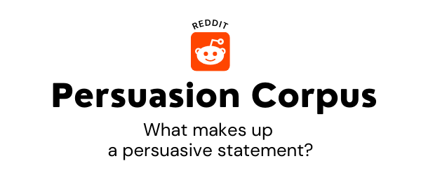
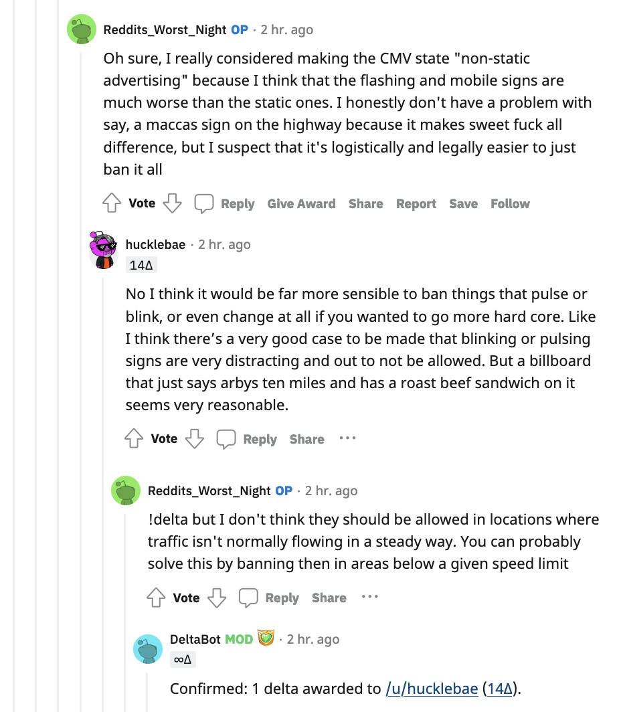

[Corpus](https://drive.google.com/drive/folders/1mjYBNIJW6TkdIdxkeuXMBHrFOEEH2U17?usp=sharing) - last updated Mar 5, 2022

# Source of the corpus
This corpus was built by scraping the subreddit called "Change My View [CMV](https://www.reddit.com/r/changemyview/)" (scraper is available [here](https://github.com/toshikoshibano/reddit_scraper)). 

CMV is a very popular community for online discussion dedicated to civil discourse. According to the organizers, this community is built around the idea that understanding comes first for resolving our differences. To that end, they promote productive conversations that are marked with respect and openness" (for more details, see [here](https://www.reddit.com/r/changemyview/wiki/index)).

Our motivation was to build a corpus that could be useful for argumentation mining. Even in English, argumentation mining is still a low-resourced domain (e.g., [Skeppstedt, et al., 2018](https://aclanthology.org/W18-5218/)). "What makes an argument persuasive?" "How do people justify their stance when succeeding in persuasion?" "Are there certain linguistic cues that make people feel respected and more open to other's opinion?" These are all important research questions that are yet to be answered to fill the gap between machine-generated text and human text. 

Possible applications will include a personal coaching bot with which corporate managers can simulate negotiation and brush up their communication skills, a counseling chatbot with which the patient can interact to develop social skills, and a ghost writer that can transform human text into more persuasive writing. 

CMV is a perfect choice for us because, not only it has a record history of constructive arguments, but also it has a special symbol, delta, to acknowledge the opinion that successfully changed someone's view. This approach has been employed in the literature, but the sizes of their corpora are very small (e.g., [Hidey, et al., 2017](https://aclanthology.org/W17-5102/)). This fact made our choice even more focused. Instead of just scraping all the text in CMV, we scraped multi-participant discourse that eventually led to 'Aha!', the moment that is signified by the symbol delta. 

For example, below is a thread from the topic "Roadside advertising should be illegal." Here, the participant Reddits_Worst_Night granted "delta" to the participant hucklebae, which was then confirmed by DeltaBot (Reddit's bot that checks the validity of deltas). The six light-gray lines to the left of the delta giver Reddits_Worst_Night signifies this thread contains six comments in total.

# Corpus Statistics
- Total number of documents: 2,235 submission posts and 2,513 delta threads
- Total number of words: 2,235,463 English words (997,477 words in the submissions + 1,237,986 words in the threads)
- Known problems: Data is scraped as is. For thorough data cleaning, preprocessing needs to be applied first systematically (e.g., stripping off carrige returns, unnecessary spacing) and then manually (e.g., remove enigmatic characters, incomplete sentences).
For the verification of the overall counts, please see [here](corpus_info.ipynb)

# Annotation ideas
- opinion-specific sentiment analysis: "blaming", "supporting", "neutral"
- opinion subjectivity: "expressive" (e.g. blathered) vs. "direct" (e.g. praised)
- argument structure: "claim", "premise", "agreement", "attack-rebuttal", "attack-undercutter"
- sarcasm

The annotation scheme defines what kind of linguistic signals we want to amplify from the text. Depending on how we annotate it, the same set of text can emit different sets of signals, each having a different probability distribution. 

# File organization

The data is comprised of three files. 
- `submission.json` contains topic submission data ("submission" = the root comment submitted to post a new discussion topic)
- `delta_thread.json` contains a series of comments that eventually led to a change of perspective. That change is signified by `delta` signage. 
- `log.json` keeps track of scraping progress. 

### Data structure and metadata
`submission.json`
| Field name        | Type            | Description                  |
|-------------------|-----------------|------------------------------|
| submission_id     | list of strings | Reddit's submission ID       |
| submission_author | same as above   | Author's Reddit account name |
| submission_url    | same as above   | The link to the post         |
| submission_title  | same as above   | The title of the post        |
| submission_body   | same as above   | The body text of the post    |

`delta_thread.json`
| Field name | Type | Description                                                                     |
|------------|------|---------------------------------------------------------------------------------|
| thread_id  | dict | a dictionary where the key is `thread_id` and the value is a list of comments.  

`thread_id` is named after `{submission_id}-{comment_id}` so that each thread can be treated as a tree of children under the root of sumbmission (discussion topic).

`log.json`
| Field name      | Type     | Description                                                           |
|-----------------|----------|-----------------------------------------------------------------------|
| updated_at      | DateTime | Timestamp of the submission's initial post                            |
| updated_utc     | UTC      | Same as above but in UTC format                                       |
| delta_receivers | list     | Reddit users who have received one or more delta from some other user |
| todo            | list     | TODO list for a scraper                                               |
| done            | list     | DONE list for a scraper                                               |
| invalid_threads | list     | Threads that contain deleted or removed post/user.                    |

The log fields are used for controling the scraping process. For details, see the [Reddit Scraper documentation](https://github.com/toshikoshibano/reddit_scraper).